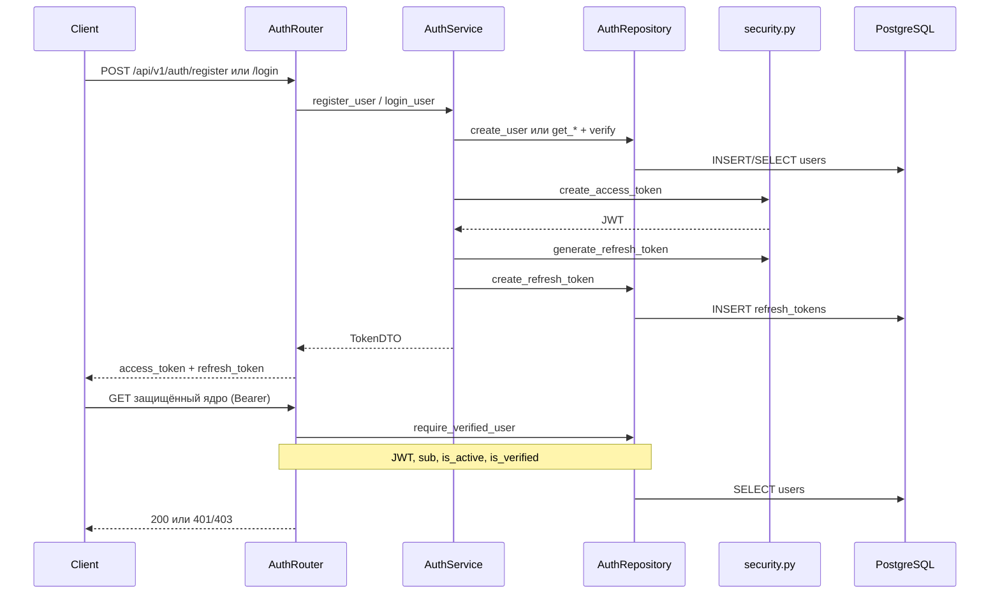

# Авторизация и аутентификация (текущее состояние)

Документ описывает только цепочку: регистрация, логин, выдача токенов, проверка **access JWT** на защищённых HTTP-эндпоинтах. Поведение привязано к коду в репозитории `diploma-backend`.

## Границы системы

- **Входит:** учётные записи с паролем и/или **Google OAuth**, bcrypt (если пароль задан), JWT access, запись refresh в БД, заголовок `Authorization: Bearer`.
- **Не является отдельным способом «логина»:** привязка Telegram (`AuthService` + `GET/POST` в `src/api/v1/telegram.py`). Пользователь уже должен быть аутентифицирован (Bearer); бот лишь связывает `telegram_chat_id` с существующим пользователем.

---

## Публичный HTTP API

Префикс приложения: в `src/main.py` роутеры монтируются с `prefix="/api/v1"`. Роутер авторизации объявлен с `prefix="/auth"` в `src/api/v1/auth.py`.

| Метод | Путь | Назначение |
|--------|------|------------|
| `POST` | `/api/v1/auth/register` | Регистрация (`is_verified=false`, письмо с ссылкой) |
| `POST` | `/api/v1/auth/login` | Вход |
| `GET` | `/api/v1/auth/me` | Текущий пользователь (требует Bearer) |
| `POST` | `/api/v1/auth/verify-email` | Подтверждение email по одноразовому токену (публичный) |
| `POST` | `/api/v1/auth/resend-verification` | Повторная отправка ссылки (Bearer) |
| `POST` | `/api/v1/auth/forgot-password` | Запрос ссылки сброса пароля (публичный; ответ всегда одинаковый) |
| `POST` | `/api/v1/auth/reset-password/validate` | Проверка одноразового токена сброса (публичный) |
| `POST` | `/api/v1/auth/reset-password` | Установка нового пароля по токену (публичный) |
| `POST` | `/api/v1/auth/google` | Вход через Google (authorization code + `redirect_uri`; публичный) |

### POST `/api/v1/auth/register`

- **Тело (JSON):** схема `UserRegister` — `src/api/v1/schemas/user.py`
  - `username`: строка 3–50 символов, только `a-zA-Z0-9_-` (после `strip`).
  - `email`: валидный email (`EmailStr`).
  - `password`: 8–100 символов, минимум одна заглавная, одна строчная, одна цифра.
- **Ответ 201:** `TokenResponse` — `access_token`, `refresh_token`, `token_type` (по умолчанию `"bearer"`).
- **400:** валидация Pydantic или бизнес-ошибка (`ValueError`, например «Username already exists» / «Email already exists») — в `detail` передаётся текст исключения.
- **500:** прочие ошибки — `detail`: `"Failed to register user"`.

После создания пользователя создаётся запись в `registration_tokens`, в лог пишется ссылка вида `{FRONTEND_URL}/verify-email?token=...` через `LoggingEmailService` (`src/services/email_service.py`). В проде замените реализацию `EmailService` (например SMTP) в DI, не меняя `AuthService`.

Логируются `user-agent` и `client.host` (IP), передаются в слой сервиса для сохранения вместе с refresh (см. ниже).

### POST `/api/v1/auth/login`

- **Тело (JSON):** `UserLogin` — поле `login` (3–100 символов), `password` (`min_length=1` на схеме).
- **Разбор `login`:** в `AuthService.login_user` — если в строке есть `"@"`, поиск пользователя по **email**, иначе по **username**.
- **Ответ 200:** `TokenResponse` (как при регистрации).
- **401:** неверные учётные данные или неактивный аккаунт — сообщения из `ValueError`: `"Invalid credentials"`, `"Account is inactive"`.
- **500:** `detail`: `"Failed to login"`.

### GET `/api/v1/auth/me`

- **Заголовок:** `Authorization: Bearer <access_token>`.
- **Ответ 200:** `UserResponse` — `id` (ULID), `username`, `email`, `is_active`, `is_verified`, `has_password`, `auth_providers` (например `["password"]`, `["google"]` или оба).
- Ошибки авторизации — как в разделе [Защита эндпоинтов](#защита-эндпоинтов).

### POST `/api/v1/auth/google`

- **Тело:** `GoogleOAuthLoginRequest` — `code` (authorization code от Google), `redirect_uri` (должен **точно** совпадать с одним из значений в `GOOGLE_ALLOWED_REDIRECT_URIS`; для фронта с `@react-oauth/google` в режиме auth-code обычно `postmessage`).
- **Ответ 200:** `TokenResponse`, как у `/login`.
- **400 / 403 / 503:** JSON `{"detail": "...", "code": "..."}` — коды: `GOOGLE_OAUTH_DISABLED`, `GOOGLE_OAUTH_NOT_CONFIGURED`, `INVALID_REDIRECT_URI`, `INVALID_GOOGLE_CODE`, `GOOGLE_EMAIL_NOT_VERIFIED`, `OAUTH_ACCOUNT_CONFLICT`, `ACCOUNT_INACTIVE` (неактивный пользователь — 403).

**Политика связывания аккаунтов:**

1. Если есть строка в `oauth_accounts` с `provider=google` и `provider_user_id=sub` из токена — вход в привязанного пользователя.
2. Иначе, если локальный пользователь с тем же email (без учёта регистра) уже есть: при отсутствии другой привязки Google создаётся запись `oauth_accounts`; если у пользователя уже другой `sub` Google — ошибка `OAUTH_ACCOUNT_CONFLICT`. Если Google подтвердил email, а локальный `is_verified=false`, выставляется `is_verified=true`.
3. Иначе создаётся новый пользователь с `hashed_password=NULL`, уникальным `username` (генерация из email/имени), `is_verified=true`, и строка в `oauth_accounts`.

Парольный логин для пользователя без пароля даёт «Invalid credentials». Сброс пароля может выставить первый пароль для такого аккаунта.

### POST `/api/v1/auth/verify-email`

- **Тело:** `{"token": "<из query ссылки>"}` — схема `VerifyEmailRequest` (`min_length=10`, токен обрезается по краям).
- **Ответ 200:** `{"status": "ok"}`.
- **400:** неверный или просроченный токен — `detail` с текстом ошибки.
- Идемпотентность: если аккаунт уже подтверждён, ответ успешный; одноразовый токен помечается использованным.

### POST `/api/v1/auth/resend-verification`

- **Заголовок:** `Authorization: Bearer`.
- **Ответ 204:** письмо поставлено в очередь (в dev — запись в лог).
- **400:** уже подтверждён (`Email already verified`) или иные ошибки валидации.

### POST `/api/v1/auth/forgot-password`

- **Тело:** `{"email": "..."}` — схема `ForgotPasswordRequest`.
- **Ответ 200:** всегда одно и то же тело (`ForgotPasswordResponse`: `status`, нейтральное `message`), независимо от того, зарегистрирован ли email. Это снижает перечисление аккаунтов.
- **Поведение:** при существующем пользователе (поиск email без учёта регистра) старые неиспользованные токены сброса помечаются использованными, создаётся новая запись в `password_reset_tokens` (в БД хранится только SHA-256 hex от сырого токена), отправляется письмо со ссылкой `{FRONTEND_URL}/reset-password?token=...`.

### POST `/api/v1/auth/reset-password/validate`

- **Тело:** `{"token": "..."}` — как в query ссылки (обрезка пробелов по краям).
- **Ответ 200:** `{"valid": true}` или `{"valid": false, "code": "RESET_TOKEN_INVALID" | "RESET_TOKEN_USED" | "RESET_TOKEN_EXPIRED"}`. Коды не раскрывают наличие пользователя.

### POST `/api/v1/auth/reset-password`

- **Тело:** `token`, `password` — сила пароля как при регистрации (`src/core/password_policy.py`).
- **Ответ 200:** `{"status": "ok"}`.
- **400:** тело JSON `{"detail": "<сообщение>", "code": "<код>"}` (не стандартный FastAPI `HTTPException` для этого маршрута), те же коды, что и при `valid: false` на validate.
- После успеха: обновляется `users.hashed_password`, токен сброса помечается использованным, прочие неиспользованные токены сброса пользователя инвалидируются, все неотозванные `refresh_tokens` пользователя помечаются `is_revoked=true`.

### Refresh по HTTP

В docstring модуля `src/api/v1/auth.py` упоминается «token refresh», но **эндпоинта обмена refresh на новый access нет**. При каждом успешном `register` и `login` в БД создаётся новая строка refresh; клиент получает пару токенов в теле ответа, дальнейшее использование refresh в API не реализовано.

---

## JWT (access token)

| Параметр | Источник / значение |
|----------|---------------------|
| Библиотека | PyJWT (`jwt`) |
| Алгоритм | `Config.ALGORITHM`, по умолчанию `HS256` (`src/core/config.py`) |
| Секрет подписи | `SECRET_KEY` (обязательная переменная окружения) |
| TTL | `ACCESS_TOKEN_EXPIRE_MINUTES` (по умолчанию `30`) |

**Создание:** `create_access_token` в `src/core/security.py` — в payload копируются переданные поля, добавляются `exp` (UTC) и `type: "access"`.

**Фактические claims после register/login:** `sub` — строковый ULID пользователя (`str(user.id)`), `username` — имя пользователя.

**Проверка:** `decode_access_token` — `jwt.decode` с `SECRET_KEY` и списком алгоритмов из конфига; дополнительно `payload["type"]` должен быть `"access"`, иначе `InvalidTokenError`.

Истёкший или битый токен на защищённых маршрутах даёт **401** с `WWW-Authenticate: Bearer` (где применимо в коде).

---

## Refresh-токены

| Параметр | Детали |
|----------|--------|
| Генерация | `secrets.token_urlsafe(32)` — `generate_refresh_token` в `src/core/security.py` |
| Таблица | `refresh_tokens` — модель `RefreshToken` в `src/models/auth.py` |
| Поля | `token` (unique), `user_id`, `expires_at`, `is_revoked`, опционально `user_agent`, `ip_address` |
| Срок жизни | `now + timedelta(days=REFRESH_TOKEN_EXPIRE_DAYS)`; дни из `Config.REFRESH_TOKEN_EXPIRE_DAYS` (по умолчанию `7`) |

**Пробел реализации:** в `AuthRepository` нет методов поиска/валидации refresh по значению токена, нет отзыва/ротации и нет HTTP-роута — только `create_refresh_token`. Это место зарезервировано под будущий refresh-flow.

---

## Пароли

- Хэширование и проверка: **bcrypt** — `hash_password` / `verify_password` в `src/core/security.py`.
- Сложность пароля на **регистрации** и **сбросе пароля** — общая функция `validate_password_strength` в `src/core/password_policy.py` (вызывается из схем Pydantic `UserRegister`, `ResetPasswordRequest`).
- На **логине** схема ослабляет проверку длины пароля; фактическая проверка — `verify_password` против `user.hashed_password`.

---

## Модель пользователя и БД

Модель `User` (`src/models/auth.py`):

- Обязательные поля: `username`, `email` (уникальные индексы), `is_active` (по умолчанию `True` при создании в репозитории). Поле `hashed_password` может быть **NULL** для аккаунтов только через Google; тогда вход только через Google (или после установки пароля через сброс).
- **`is_verified`:** подтверждение email; при самостоятельной регистрации выставляется `False`, доступ к «ядру» API (см. ниже) до подтверждения закрыт зависимостью `require_verified_user`.
- Прочее: `stripe_customer_id`, поля Telegram (`telegram_chat_id`, одноразовый `telegram_connect_token` и срок).

### `oauth_accounts`

Связь локального пользователя с внешним провайдером: `user_id`, `provider` (например `google`), `provider_user_id` (Google `sub`), снимок `email`. Уникальность `(provider, provider_user_id)`.

### `registration_tokens`

Одноразовые токены подтверждения email: `token`, `user_id`, `expires_at`, `is_used`. Срок жизни задаётся `EMAIL_VERIFICATION_TOKEN_EXPIRE_HOURS` в конфиге. После успешной верификации токен помечается `is_used=true`. При повторной отправке письма неиспользованные токены пользователя инвалидируются (`is_used=true`).

### `password_reset_tokens`

Одноразовые ссылки сброса пароля: `token_hash` (SHA-256 hex от сырого токена из письма, **сырое значение в БД не хранится**), `user_id`, `expires_at`, `is_used`. Срок — `PASSWORD_RESET_TOKEN_EXPIRE_HOURS`. При новом запросе сброса неиспользованные строки пользователя помечаются использованными. После успешной смены пароля текущий токен помечается использованным; дополнительно инвалидируются прочие неиспользованные токены сброса этого пользователя.

---

## Защита эндпоинтов

Общая реализация в `src/services/shared/auth_helpers.py` (функция `_build_authenticated_user_dto`): JWT → `sub` → пользователь → проверка `is_active` → `AuthenticatedUserDTO` (включая `is_verified`).

### `get_authenticated_user_dependency`

Любой валидный Bearer, в том числе **неподтверждённый email**. Используется там, где пользователь должен иметь доступ до подтверждения:

| Файл | Контекст |
|------|----------|
| `src/api/v1/auth.py` | `GET /auth/me`, `POST /auth/resend-verification` |

### `require_verified_user`

Те же шаги, плюс если `not user.is_verified` → **403** `Email address not verified`.

| Файл | Контекст |
|------|----------|
| `src/api/v1/telegram.py` | операции с Telegram |
| `src/api/v1/ai_detection.py` | детекция |
| `src/api/v1/limits.py` | лимиты |
| `src/api/v1/billing.py` | биллинг |
| `src/api/dependencies/rate_limit.py` | rate limit для защищённых маршрутов |

Алиас типа: `VerifiedUser = Annotated[..., Depends(require_verified_user)]`.

### Альтернатива в кодовой базе

`get_current_user` и тип `CurrentUser` в `src/core/dependencies.py` реализуют схожую логику через `FromDishka[AuthRepository]` и `FromDishka[Config]`. **Ни один роутер в проекте их не импортирует** — фактический путь для FastAPI + Dishka — зависимости из `auth_helpers`.

---

## Карта кода

| Слой | Файлы |
|------|--------|
| HTTP-схемы запрос/ответ | `src/api/v1/schemas/user.py` |
| Роуты auth | `src/api/v1/auth.py` |
| DTO между слоями | `src/dtos/user_dto.py` |
| Бизнес-логика | `src/services/auth_service.py` |
| Доступ к БД | `src/repositories/auth_repository.py` |
| Модели SQLAlchemy | `src/models/auth.py` |
| JWT и пароли | `src/core/security.py`, `src/core/password_policy.py` |
| Конфиг (JWT, длительности) | `src/core/config.py` |
| Письма (верификация и сброс пароля) | `src/services/email_service.py`, провайдер `src/ioc/email_provider.py` |
| DI-зависимость «текущий пользователь» | `src/services/shared/auth_helpers.py` |
| Неиспользуемый дублирующий Depends | `src/core/dependencies.py` |

Поток: **схема API** → DTO → **AuthService** → **AuthRepository** → **User / OAuthAccount / RefreshToken / RegistrationToken / PasswordResetToken**; токены выдаются через **security**; верификация и сброс пароля вызывают **EmailService**; Google — **GoogleOAuthClient** (`src/services/google_oauth_client.py`).

---

## Переменные окружения (аутентификация)

| Переменная | Назначение | Пример / умолчание в коде |
|------------|------------|---------------------------|
| `SECRET_KEY` | Подпись JWT | обязательно задать в проде |
| `ALGORITHM` | Алгоритм JWT | `HS256` |
| `ACCESS_TOKEN_EXPIRE_MINUTES` | Жизнь access | `30` |
| `REFRESH_TOKEN_EXPIRE_DAYS` | Срок refresh в БД | `7` |
| `EMAIL_VERIFICATION_TOKEN_EXPIRE_HOURS` | Срок одноразового токена в `registration_tokens` | `48` |
| `PASSWORD_RESET_TOKEN_EXPIRE_HOURS` | Срок одноразового токена в `password_reset_tokens` | `24` |
| `FRONTEND_URL` | Базовый URL для ссылки в письме верификации | `http://localhost:3000` |
| `SMTP_HOST` | Если задан (непустой), письма идут через **SMTP** (`SmtpEmailService`) | пусто → только лог (`LoggingEmailService`) |
| `SMTP_PORT` | Порт SMTP | `587` (STARTTLS) или `465` (SSL) |
| `SMTP_USER` / `SMTP_PASSWORD` | Аутентификация на релее (часто app password) | опционально для открытых релеев |
| `SMTP_FROM_EMAIL` | Заголовок `From` | по умолчанию `SMTP_USER` |
| `SMTP_USE_TLS` | STARTTLS после подключения (типично порт 587) | `true` |
| `SMTP_SSL` | Неявный TLS с начала соединения (порт 465) | `false` |
| `GOOGLE_OAUTH_ENABLED` | Включить `POST /auth/google` | `false` |
| `GOOGLE_CLIENT_ID` | OAuth 2.0 Client ID (Google Cloud) | пусто |
| `GOOGLE_CLIENT_SECRET` | Client secret | пусто |
| `GOOGLE_ALLOWED_REDIRECT_URIS` | Допустимые `redirect_uri` через запятую (точное совпадение) | например `postmessage` |

Остальные переменные БД (`DB_*`) нужны для пользователей и refresh-записей.

В **проде** задайте `FRONTEND_URL` на публичный URL фронтенда и непустой `SMTP_HOST`; при `DEBUG=false` без SMTP в лог пишется предупреждение `email_using_logging_backend`.

Миграция `c8d2e9f1a3b4_email_verification`: колонка `users.is_verified`, переименование `registration_tokens.created_by` → `user_id`, индекс по `user_id`. Существующие на момент миграции пользователи получают `is_verified=true` (не блокируются).

Миграция `d4e5f6a7b8c9_password_reset_tokens`: таблица `password_reset_tokens`.

Миграция `e7f8a9b0c1d2_oauth_accounts`: таблица `oauth_accounts`, колонка `users.hashed_password` становится nullable.

---

## Диаграмма потоков

---

## Зачатки для следующих задач

1. **Refresh HTTP-flow:** обмен refresh на новый access, эндпоинт вида `POST /api/v1/auth/refresh`.
2. **Почта:** при наличии `SMTP_HOST` используется `SmtpEmailService` (`build_email_service` в `src/services/email_service.py`).

Интеграция с фронтендом: репозиторий `diploma-front` (маршруты `/verify-email`, `/check-email`, баннер в дашборде). Краткий контракт: [docs/FRONTEND_EMAIL_VERIFICATION.md](FRONTEND_EMAIL_VERIFICATION.md).
