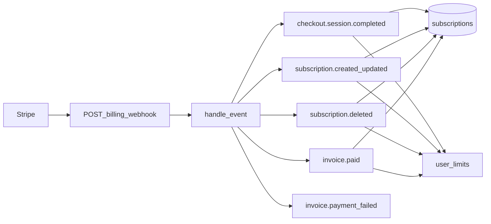

# Stripe и Premium: документация бэкенда

Фактическое поведение кода в этом репозитории. Используйте для планирования доработок (в т.ч. программной отмены подписки).

## 1. Назначение

- Подписка на один продукт: цена задаётся переменной окружения `STRIPE_PRICE_ID`. Checkout создаётся в режиме `subscription` ([`src/services/stripe_service.py`](../src/services/stripe_service.py)).
- **Состояние подписки в БД обновляется только из вебхуков Stripe.** Запросы `POST /billing/cancel` и `POST /billing/resume` лишь вызывают Stripe API (`Subscription.modify`); строки в БД и лимиты по-прежнему обновляются вебхуками.

## 2. Переменные окружения

| Переменная | Назначение |
|------------|------------|
| `STRIPE_SECRET_KEY` | Ключ API Stripe; при наличии выставляется `stripe.api_key` |
| `STRIPE_WEBHOOK_SECRET` | Секрет подписи вебхука для `stripe.Webhook.construct_event` |
| `STRIPE_PRICE_ID` | ID цены подписки (line item в Checkout) |
| `FRONTEND_URL` | База для `success_url`, `cancel_url` Checkout и `return_url` Customer Portal |

Источник полей: [`src/core/config.py`](../src/core/config.py), пример значений: [`.env.example`](../.env.example).

**Эндпоинт вебхука (относительно приложения):** `POST /api/v1/billing/webhook`  
Монтирование: [`src/main.py`](../src/main.py) — `billing_router` с префиксом `/api/v1`, сам роутер с префиксом `/billing` ([`src/api/v1/billing.py`](../src/api/v1/billing.py)).

## 3. Модель данных

### Пользователь

- Колонка **`users.stripe_customer_id`** — ID Customer в Stripe. Заполняется при Checkout / создании Customer.  
  Модель: [`src/models/auth.py`](../src/models/auth.py), миграция: [`alembic/versions/a3f1b2c4d5e6_add_stripe_subscription.py`](../alembic/versions/a3f1b2c4d5e6_add_stripe_subscription.py).

### Подписка (`subscriptions`)

| Поле | Смысл |
|------|--------|
| `user_id` | FK на пользователя, **уникален** (одна строка подписки на пользователя) |
| `stripe_subscription_id` | ID подписки в Stripe, уникален |
| `status` | Строка статуса Stripe (`active`, `trialing`, `past_due`, `canceled`, …) |
| `plan_type` | По умолчанию `premium` |
| `current_period_end` | Конец текущего биллинг-периода (UTC) |
| `cancel_at_period_end` | Запланирована ли отмена на конец периода |

Модель: [`src/models/subscription.py`](../src/models/subscription.py).  
Репозиторий (upsert по `user_id`): [`src/repositories/subscription_repository.py`](../src/repositories/subscription_repository.py).

### Лимиты AI detection (`user_limits`)

Премиум влияет на **лимиты запросов** и флаг `is_premium` в таблице лимитов (связь с AI detection). Обновление из биллинга: [`AIDetectionRepository.update_user_limits`](../src/repositories/ai_detection_repository.py).  
Новый пользователь получает free-дефолты при первом `get_or_create_user_limit` ([`src/repositories/ai_detection_repository.py`](../src/repositories/ai_detection_repository.py)).

## 4. Лимиты Free vs Premium

Константы в [`src/core/billing.py`](../src/core/billing.py):

| Уровень | Daily | Monthly |
|---------|-------|---------|
| Free | 10 | 100 |
| Premium | 100 | 1000 |

**«Активная подписка» для HTTP API** (не путать с флагом в `user_limits`):

```python
ACTIVE_SUBSCRIPTION_STATUSES = {"active", "trialing"}
```

Используется в `GET /api/v1/billing/subscription` для поля `is_premium` ([`src/api/v1/billing.py`](../src/api/v1/billing.py)).

## 5. HTTP API

Базовый путь: `/api/v1/billing`. Схемы ответов: [`src/api/v1/schemas/billing.py`](../src/api/v1/schemas/billing.py).

| Метод | Путь | Аутентификация | Описание |
|-------|------|----------------|----------|
| POST | `/webhook` | Нет (проверка `Stripe-Signature`) | Входящие события Stripe; **скрыт из OpenAPI** (`include_in_schema=False`) |
| POST | `/checkout` | Верифицированный пользователь | Возвращает URL Stripe Checkout для оформления подписки |
| GET | `/subscription` | Верифицированный пользователь | Статус подписки; поля включая `cancel_at_period_end`, `stripe_subscription_id` (если есть строка подписки) |
| POST | `/portal` | Верифицированный пользователь | URL Stripe Customer Portal (нужен `stripe_customer_id` у пользователя) |
| POST | `/cancel` | Верифицированный пользователь | Запрос отмены в конце периода: `Subscription.modify(..., cancel_at_period_end=True)` в Stripe; БД синхронизируется вебхуками |
| POST | `/resume` | Верифицированный пользователь | Снять отмену в конце периода: `cancel_at_period_end=False` в Stripe; БД — вебхуки |

### Ответы `POST /cancel` и `POST /resume`

Тело успеха (`BillingActionResponse`): `status`, `message`, `sync_pending` (после успешного вызова Stripe локальная БД может обновиться с задержкой, пока не придёт `customer.subscription.updated`), `already_scheduled` — только для cancel, если отмена уже была запланирована (идемпотентный успех без повторного вызова Stripe).

### Ошибки (JSON)

Формат: `{"detail": "<сообщение>", "code": "<код>"}`. Примеры кодов:

| Код | Когда |
|-----|--------|
| `NO_ACTIVE_SUBSCRIPTION` | Нет подписки или статус не `active`/`trialing` (для cancel) |
| `SUBSCRIPTION_NOT_FOUND` | Нет строки подписки (resume) |
| `CANCELLATION_NOT_SCHEDULED` | Resume при отсутствии запланированной отмены (409) |
| `STRIPE_NOT_CONFIGURED` | Нет `STRIPE_SECRET_KEY` (503) |
| `STRIPE_REQUEST_FAILED` | Ошибка Stripe API (502) |

### Важно: `GET /subscription` vs `user_limits.is_premium`

- `is_premium` в ответе вычисляется как **`sub.status in ACTIVE_SUBSCRIPTION_STATUSES`**, а не из колонки `user_limits.is_premium`.
- Лимиты и флаг премиума в `user_limits` выставляются вебхуками (`_apply_premium` / `_apply_free`). В нормальном потоке оба источника согласованы; при сбоях доставки вебхуков теоретически возможно расхождение — при отладке смотреть оба.

## 6. Поведение StripeService

Файл: [`src/services/stripe_service.py`](../src/services/stripe_service.py).

### Checkout

- `create_checkout_session`: `client_reference_id=user_id`, `metadata["user_id"]=user_id`, один line item с `STRIPE_PRICE_ID`.
- После успешной оплаты обрабатывается `checkout.session.completed`: сохранение `stripe_customer_id`, `Subscription.retrieve`, upsert в `subscriptions`, затем **`_apply_premium`**.

### Обработчики вебхуков (регистрация в `handle_event`)

| Событие | Действие |
|---------|----------|
| `checkout.session.completed` | См. выше |
| `customer.subscription.created` | `_handle_subscription_upsert` |
| `customer.subscription.updated` | `_handle_subscription_upsert` |
| `customer.subscription.deleted` | Статус `canceled`, `cancel_at_period_end=True`, **`_apply_free`** |
| `invoice.paid` | Обновление периода/статуса по подписке, **`_apply_premium`** (если есть локальная подписка) |
| `invoice.payment_failed` | Только лог `invoice_payment_failed` — **лимиты не меняются** в этом обработчике |

Остальные типы событий игнорируются (debug-лог).

### Премиум / free

- `_apply_premium`: `daily_limit=PREMIUM_DAILY_LIMIT`, `monthly_limit=PREMIUM_MONTHLY_LIMIT`, `is_premium=True` в `user_limits`.
- `_apply_free`: free-лимиты, `is_premium=False`.

В **`_handle_subscription_upsert`**: если `status in ACTIVE_SUBSCRIPTION_STATUSES` → `_apply_premium`, иначе → `_apply_free` (например `past_due` уводит в free — см. тесты).

### Разрешение `user_id` для событий подписки

`_resolve_user_id`: сначала `metadata["user_id"]` у объекта Stripe, иначе поиск пользователя по `users.stripe_customer_id`.

### Программная отмена / возобновление (только Stripe API)

- `cancel_subscription_for_user` / `resume_subscription_for_user`: читают локальную подписку, вызывают `stripe.Subscription.modify` с `cancel_at_period_end` true/false. **Не** вызывают `subscription_repo.upsert` и **не** трогают `user_limits` — только вебхуки.

## 7. Диаграмма потока вебхуков



## 8. Отмена и возобновление подписки

- **Программная отмена:** `POST /api/v1/billing/cancel` вызывает `stripe.Subscription.modify(sub_id, cancel_at_period_end=True)`. Локальная строка `subscriptions` и лимиты обновляются после **`customer.subscription.updated`** (и при необходимости других событий), не в обработчике REST.
- **Возобновление:** `POST /api/v1/billing/resume` — `cancel_at_period_end=False`, только пока подписка ещё `active`/`trialing` и в БД было `cancel_at_period_end=true`.
- **Идемпотентность cancel:** если отмена уже запланирована (`cancel_at_period_end` в БД ещё до вебхука может отставать; сервис проверяет локальную строку), возвращается успех с `already_scheduled=true` без повторного вызова Stripe.
- **Customer Portal** (`POST /portal`) по-прежнему доступен как альтернативный способ управления биллингом в Stripe.

**Поведение при отмене в конце периода**

- Пока статус **`active`** или **`trialing`**, пользователь остаётся премиум в `GET /subscription` и по лимитам, даже если `cancel_at_period_end=true`. После окончания периода приходит `customer.subscription.deleted` (или смена статуса) — срабатывает free-логика в вебхуках.

### Фронтенд

В этом репозитории нет приложения фронтенда. Готовый пример страницы биллинга (React/TS) для копирования в ваш UI: [`examples/billing-cancel-frontend/BillingPage.example.tsx`](../examples/billing-cancel-frontend/BillingPage.example.tsx).

## 9. Локальная разработка

- В [`.env.example`](../.env.example): для локали подставить `STRIPE_WEBHOOK_SECRET` из вывода `stripe listen --forward-to http://localhost:8000/api/v1/billing/webhook`.
- В [`docker-compose.yml`](../docker-compose.yml) сервис **`stripe-listener`** (профиль `tools`, образ `stripe/stripe-cli`): команда `listen` с `--forward-to` из переменной `STRIPE_FORWARD_TO` (по умолчанию в файле указан внешний URL — для локальной отладки переопределите на свой туннель или `http://host.docker.internal:8000/...` при необходимости).

## 10. Тесты

- Вебхуки и лимиты: [`tests/test_stripe_webhook.py`](../tests/test_stripe_webhook.py).
- Cancel/resume (мок Stripe API): [`tests/test_billing_cancel.py`](../tests/test_billing_cancel.py).

## Ключевые файлы

| Файл | Роль |
|------|------|
| [`src/services/stripe_service.py`](../src/services/stripe_service.py) | Checkout, Portal, cancel/resume, вебхуки, premium/free |
| [`src/api/v1/billing.py`](../src/api/v1/billing.py) | HTTP-эндпоинты |
| [`src/core/billing_exceptions.py`](../src/core/billing_exceptions.py) | Исключения с кодами для billing-действий |
| [`src/core/billing.py`](../src/core/billing.py) | Лимиты и `ACTIVE_SUBSCRIPTION_STATUSES` |
| [`src/repositories/subscription_repository.py`](../src/repositories/subscription_repository.py) | Upsert подписок |
| [`src/repositories/ai_detection_repository.py`](../src/repositories/ai_detection_repository.py) | `update_user_limits` |
