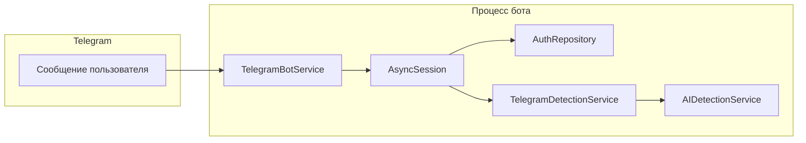

# Документация Telegram-бота

Техническое описание бота проверки текста на признаки генерации ИИ в проекте diploma-backend. Бот — **транспортный слой**: маршрутизация сообщений Telegram, загрузка файлов и форматирование ответов. Вся бизнес-логика детекции, лимитов и истории выполняется теми же сервисами, что и HTTP API.

## Назначение

- Проверка **обычного текста** в сообщении (не команды).
- Проверка **файлов-документов** (PDF, DOCX и другие форматы из конфигурации Gemini).
- Проверка **фотографий** с текстом (изображение обрабатывается как JPEG с синтетическим именем файла).

Работа возможна только после **привязки Telegram-чата к учётной записи на сайте** (верифицированный пользователь генерирует одноразовую ссылку в профиле).

## Переменные окружения

| Переменная | Назначение |
|------------|------------|
| `TELEGRAM_BOT_TOKEN` | Токен бота от [@BotFather](https://t.me/BotFather). Без него бот не создаётся ([`TelegramBotService`](../src/services/telegram_bot_service.py)). |
| `TELEGRAM_BOT_USERNAME` | Имя бота **без** `@`, например `MyDiplomaBot`. Нужно для генерации deep-link `https://t.me/<username>?start=<token>` при вызове `POST /telegram/connect` ([`AuthService.generate_telegram_connection_url`](../src/services/auth_service.py)). |
| `TELEGRAM_CONNECT_TOKEN_TTL_MINUTES` | Срок жизни одноразового токена привязки (по умолчанию 15 минут), см. [`Config`](../src/core/config.py). |

Остальное совпадает с основным приложением: **БД** (`DB_*`), **JWT/секреты** для API, **Gemini** (`GEMINI_*` в [`gemini_config`](../src/core/gemini_config.py)), ключи **ML-модели** и т.д. — бот использует тот же [`AppProvider`](../src/ioc/__init__.py) и те же синглтоны сервисов, что и FastAPI.

## Запуск

Бот — **отдельный процесс**, не внутри uvicorn:

```bash
python -m src.bot_main
```

Точка входа: [`src/bot_main.py`](../src/bot_main.py). При старте проверяется подключение к БД; при отсутствии `TELEGRAM_BOT_TOKEN` процесс завершится с ошибкой после сборки сервиса.

## Архитектура



- **[`TelegramBotService`](../src/services/telegram_bot_service.py)** — aiogram 3: `Bot`, `Dispatcher`, регистрация хендлеров, скачивание файлов из Telegram.
- На **каждое** входящее сообщение открывается новая сессия БД (unit of work), как в HTTP-запросах ([`_build_telegram_bot_service`](../src/bot_main.py)).
- **[`TelegramDetectionService`](../src/services/telegram_detection_service.py)** — переводит входы бота (строка/байты) в вызовы [`AIDetectionService`](../src/services/ai_detection_service.py) и возвращает [`TelegramDetectionResult`](../src/services/telegram_detection_service.py) для форматирования ответа.

Режим работы с Telegram: **long polling** (`delete_webhook` → `start_polling`, `skip_updates=True`).

## Команды

| Команда | Поведение |
|---------|-----------|
| `/start` | Без аргумента — краткое приветствие и указание привязать аккаунт через сайт. С аргументом `<token>` — привязка `telegram_chat_id` к пользователю, у которого валиден одноразовый токен. |
| `/help` | Справка: текст, файл, изображение; список команд; максимальный размер файла из `gemini_config.MAX_FILE_SIZE_MB`. |
| `/disconnect` | Отвязка Telegram от текущего пользователя по `chat_id` (аналог `DELETE /telegram/disconnect` на стороне сайта для сессии пользователя). |

## Потоки использования

### Привязка аккаунта

1. Пользователь на **сайте** (авторизован, email подтверждён) вызывает `POST /api/v1/telegram/connect` (см. [`src/api/v1/telegram.py`](../src/api/v1/telegram.py)).
2. API возвращает `bot_url` вида `https://t.me/<bot>?start=<token>`.
3. Пользователь открывает ссылку; бот получает `/start <token>`.
4. [`AuthRepository`](../src/repositories/auth_repository.py) находит пользователя по токену и сроку действия, сохраняет `telegram_chat_id`, очищает токен.

Ошибки: истёкший/неверный токен; чат уже привязан к **другому** пользователю.

### Проверка текста

- Сообщение не начинается с `/`, длина после `strip` **не меньше 50** символов.
- Пользователь найден по `telegram_chat_id`.
- Вызывается `TelegramDetectionService.detect_text` → доменная детекция с языком [`context_from_api_language("auto")`](../src/api/v1/schemas/detection_language.py).

### Проверка файла

- Событие `document`: расширение файла должно входить в `gemini_config.ALLOWED_FILE_EXTENSIONS` (см. также [`SUPPORTED_EXTENSIONS`](../src/services/telegram_bot_service.py)).
- Размер не превышает `MAX_FILE_SIZE_MB` (если Telegram передал `file_size`).
- Файл скачивается в память, затем `detect_file`.

### Проверка фото

- Берётся наибольшее разрешение из `message.photo[-1]`, скачивание байтов, синтетическое имя `photo_<file_unique_id>.jpg`, `content_type`: `image/jpeg`, вызов `detect_image` (внутри — тот же путь, что и для файла через `detect_from_file`).

## Формат ответа об успешной проверке

Сообщение собирается в [`_render_result`](../src/services/telegram_bot_service.py) (Markdown):

- Эмодзи и текстовая метка результата: ИИ / человек / неопределённо.
- Шкала уверенности (блоки █/░) и проценты.
- Метка источника: «Текст», «Файл» или «Изображение».
- При необходимости — имя файла.
- Время обработки (мс), число слов.
- **Остаток квоты:** «сегодня» и «в месяц» (`daily_remaining`, `monthly_remaining` из лимитов пользователя).

## Ошибки и граничные случаи

| Ситуация | Реакция бота |
|----------|----------------|
| Аккаунт не привязан | Текст о необходимости ссылки из профиля. |
| Текст короче 50 символов | Предупреждение с фактической длиной. |
| Неподдерживаемое расширение / слишком большой файл | Сообщение с перечнем допустимых расширений или лимитом МБ. |
| Лимиты исчерпаны | `ValueError` из домена → текст `⚠️` с текстом исключения. |
| Не удалось извлечь текст из файла/фото | `RuntimeError` → дружелюбное сообщение пользователю. |
| Прочие сбои | Логирование и общее «попробуйте позже». |
| Неизвестный тип сообщения (не текст/файл/фото) | Подсказка, что отправить, или `/help`. |

## Связь с REST API и данными

| Аспект | Поведение |
|--------|-----------|
| Пользователь и привязка | Те же поля в [`User`](../src/models/auth.py): `telegram_chat_id`, одноразовый токен привязки. |
| Детекция | Тот же [`AIDetectionService`](../src/services/ai_detection_service.py), что у эндпоинтов `/ai-detection/*`. |
| Лимиты | Таблица `user_limits`, списание и проверка — в доменном сервисе. |
| История | Успешные проверки сохраняются в `ai_detection_history` через репозиторий (как при вызовах API). |
| Статус Telegram с сайта | `GET /telegram/status`, отключение: `DELETE /telegram/disconnect` — без участия бота, только БД. |

Итог: функционально бот **не отдельный продукт**, а клиент к той же доменной модели, что и веб-интерфейс, с ограниченным набором сценариев в UI.

## См. также

- [Сквозные пользовательские сценарии (E2E user flow)](TELEGRAM_BOT_USER_FLOW_E2E.md)
- [Анализ пробелов относительно сайта и API](TELEGRAM_BOT_GAP_ANALYSIS.md)
- [Премиум и Stripe](STRIPE_PREMIUM_FEATURES.md)
