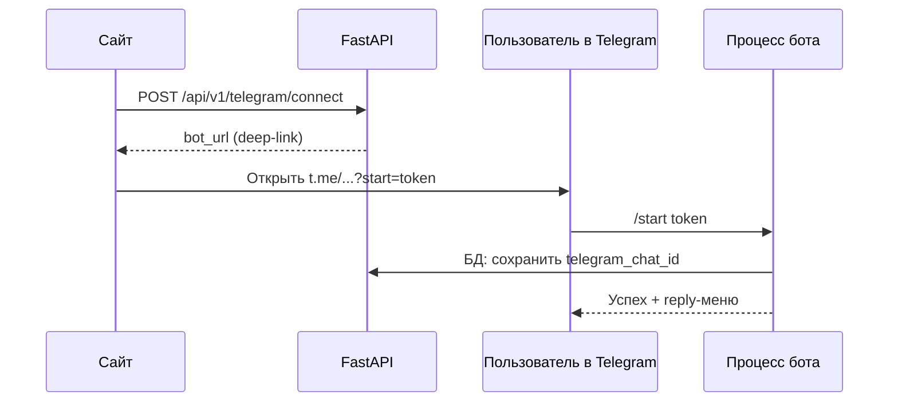
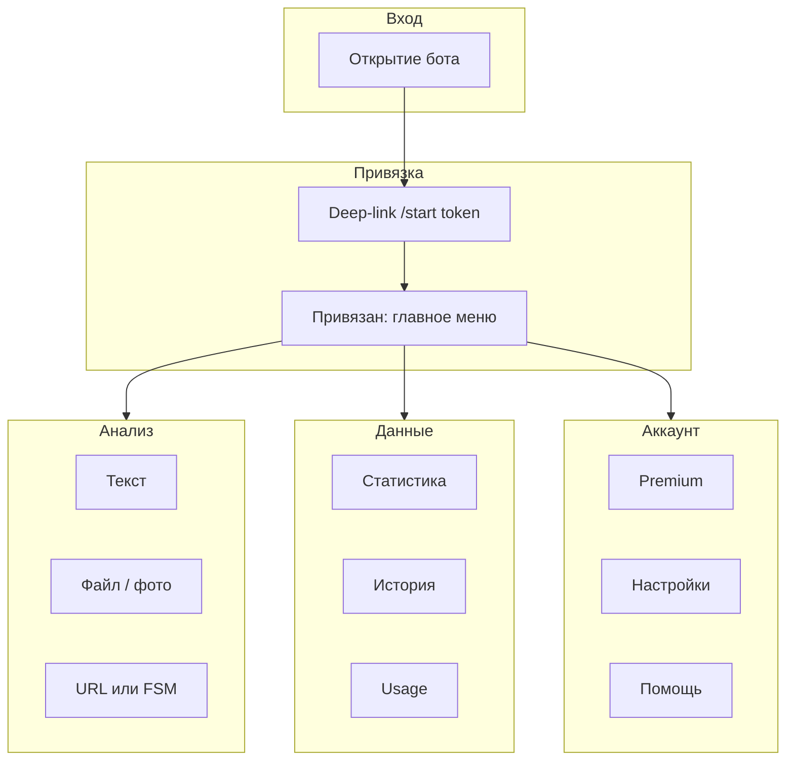

# LangProof AI — сквозные пользовательские сценарии Telegram-бота (E2E)

Документ описывает **потоки с точки зрения пользователя**: от сайта до действий в чате, включая меню, команды, inline-кнопки, состояния FSM и типичные ошибки. Предназначен для PM, поддержки и разработчиков фронтенда.

**Техническая архитектура** (процесс бота, сервисы, переменные окружения): [TELEGRAM_BOT.md](TELEGRAM_BOT.md).

**Ограничение продукта:** бот — **транспортный слой** поверх тех же доменных сервисов, что и HTTP API; публичные контракты детекции, URL и биллинга не дублируются здесь — см. исходники сервисов в репозитории.

---

## 1. Предпосылки и роли

| Условие | Описание |
|--------|----------|
| Сайт | Пользователь **зарегистрирован**, email **подтверждён** (требование API привязки Telegram). |
| Бэкенд API | Доступен `POST /api/v1/telegram/connect`, `GET /api/v1/telegram/status`, `DELETE /api/v1/telegram/disconnect`. |
| Процесс бота | Запущен отдельно: `python -m src.bot_main` ([`src/bot_main.py`](../src/bot_main.py)). |
| Конфигурация | Заданы `TELEGRAM_BOT_TOKEN`, `TELEGRAM_BOT_USERNAME` (без `@`), см. [TELEGRAM_BOT.md](TELEGRAM_BOT.md). |

**Роли и данные:**

- Один **чат Telegram** (`chat_id`) может быть привязан **ровно к одному** пользователю LangProof в БД (уникальность `users.telegram_chat_id`).
- Веб-пользователь и Telegram-чат связываются только после успешного `/start <token>` от бота.

---

## 2. Поток привязки аккаунта (сайт → Telegram)

**Шаги:**

1. На сайте пользователь инициирует подключение; фронт вызывает **`POST /api/v1/telegram/connect`** ([`src/api/v1/telegram.py`](../src/api/v1/telegram.py)).
2. Ответ содержит **`bot_url`**: `https://t.me/<TELEGRAM_BOT_USERNAME>?start=<token>`. Срок жизни токена задаётся `TELEGRAM_CONNECT_TOKEN_TTL_MINUTES`.
3. Пользователь открывает ссылку. Telegram отправляет боту сообщение **`/start <token>`**.
4. Обработчик [`handle_start` в `start_help.py`](../src/telegram_bot/routers/start_help.py) находит пользователя по токену, записывает `telegram_chat_id`, коммитит сессию, показывает **reply-клавиатуру** [`main_menu_reply`](../src/telegram_bot/keyboards.py).

**Исходы для пользователя (сообщения бота, ключи i18n):**

| Ситуация | Поведение |
|----------|-----------|
| Токен неверный или истёк | `start.bad_token` |
| Этот `chat_id` уже привязан к **тому же** пользователю LangProof | `start.connected` + меню |
| Этот `chat_id` уже привязан к **другому** пользователю | `start.other_user` — привязка **не** выполняется; на сайте у текущего веб-пользователя по-прежнему нет Telegram |
| Успешная новая привязка | `start.success` + `start.linked_hint` + меню |

**Связь с UI сайта:** фронт опрашивает **`GET /api/v1/telegram/status`** — пока бот не закрепил чат за пользователем, в БД у этого пользователя нет `telegram_chat_id`, статус «не подключён». Состояние «ожидание» на фронте отражает ожидание перехода по ссылке и успешного ответа бота, а не отдельный серверный «pending».

---

## 3. Состояние «не привязан»

Если пользователь открыл бот **без** deep-link (команда **`/start`** без аргумента):

- Если чат **ещё не** привязан: короткий CTA (`start.cta_unlinked`) и общее приветствие (`start.welcome`) — **без** полноценного reply-меню до привязки ([`start_help.py`](../src/telegram_bot/routers/start_help.py)).
- Если чат **уже** привязан: `start.connected`, подсказка `start.linked_hint`, показывается **главное меню**.

---

## 4. Главное меню (reply keyboard)

Тексты кнопок задаются i18n-ключами `menu.*` для локалей `ru` / `kk` / `en` и собираются в [`main_menu_reply`](../src/telegram_bot/keyboards.py).

**Структура (логические действия):**

| Ряд | Назначение |
|-----|------------|
| 1 | Анализ текста · Анализ файла · Анализ по ссылке (URL) |
| 2 | Моя статистика · История · Usage (лимиты) |
| 3 | Premium · Настройки · Помощь |

**Маршрутизация:** при нажатии кнопки Telegram передаёт **точный текст** метки. Бот сопоставляет его со словарём **`MENU_ACTION_BY_TEXT`**, построенным один раз при старте из переводов всех локалей ([`src/telegram_bot/menu_registry.py`](../src/telegram_bot/menu_registry.py)). Если текст не совпадает ни с одной меткой, сообщение обрабатывается как обычный ввод (например, длинный текст для анализа).

---

## 5. Сценарии анализа контента

Общие условия: пользователь **привязан**; списание лимитов и проверки выполняют доменные сервисы ([`TelegramDetectionService`](../src/services/telegram_detection_service.py) → `AIDetectionService` / `URLDetectionService`). Ответы пользователю форматируются в **HTML** ([`src/telegram_bot/formatting.py`](../src/telegram_bot/formatting.py)).

### 5.1 Текст

1. Пользователь нажимает кнопку анализа текста **или** отправляет сообщение без `/` (не совпадающее с меткой меню).
2. Бот показывает подсказку (`analyze.hint_text`) или принимает текст.
3. Минимальная длина **50 символов**; иначе сообщение об ошибке (`error.user.short_text`).
4. Успех: карточка результата (вердикт, уверенность, язык ML, остаток лимитов).

Реализация: [`_handle_plain_text` в `analyze.py`](../src/telegram_bot/routers/analyze.py).

### 5.2 Файл (документ)

1. Кнопка «файл» → подсказка (`analyze.hint_file`).
2. Пользователь отправляет документ.
3. Проверяются расширение (список `gemini_config.ALLOWED_FILE_EXTENSIONS`) и размер (например, макс. **20 МБ** — [`gemini_config.MAX_FILE_SIZE_MB`](../src/core/gemini_config.py)).
4. Ошибки: `error.file.unsupported_type`, `error.file.too_large`.

Реализация: `handle_document` → `_handle_document` в [`analyze.py`](../src/telegram_bot/routers/analyze.py).

### 5.3 Фото

Пользователь отправляет фото; обработка сбрасывает FSM ожидания URL и запускает детекцию изображения. См. `handle_photo` в [`analyze.py`](../src/telegram_bot/routers/analyze.py).

### 5.4 Ссылка (URL)

Два способа:

**A. Команда:** `/url https://...` — состояние FSM сбрасывается в `idle`, URL валидируется [`validate_public_url`](../src/telegram_bot/urlutil.py), затем детекция.

**B. Кнопка меню «Ссылка»:** бот переходит в состояние **`AnalyzeFsm.expecting_url`**, отвечает подсказкой (`analyze.expecting_url`). Следующее **текстовое** сообщение интерпретируется как URL (после валидации).

**Важно:** если пользователь в режиме ожидания URL нажимает **другую кнопку reply-меню**, текст кнопки обрабатывается как **меню**, а не как URL — общая функция [`_route_reply_menu_action`](../src/telegram_bot/routers/analyze.py) вызывается до `validate_public_url` в `handle_expecting_url`, чтобы не показывать ложную ошибку «некорректная ссылка».

Отправка **документа или фото** в режиме ожидания URL также сбрасывает FSM (`idle`) и обрабатывается как файл/фото.

---

## 6. Команды (slash)

Регистрация разнесена по модулям [`src/telegram_bot/routers/`](../src/telegram_bot/routers/).

| Команда | Назначение |
|---------|------------|
| `/start` | Привязка с токеном, приветствие, повторное открытие без токена |
| `/help` | Список команд, размер файла, описание меню |
| `/usage`, `/limits` | Карточка лимитов (алиасы, один обработчик) |
| `/stats` | Статистика проверок |
| `/history` | Первая страница истории |
| `/lang` | Язык анализа (ML): аргументы `ru` \| `kk` \| `auto` |
| `/url` | Анализ URL из аргумента команды |
| `/premium` | Экран Premium и ссылки Stripe (при наличии конфигурации) |
| `/disconnect` | Отвязка Telegram от учётной записи по текущему чату |

---

## 7. Inline: навигация, история, настройки, Premium

### 7.1 Настройки

- Сообщение с текстом настроек и inline: **язык интерфейса** / **язык анализа** ([`settings_root_inline`](../src/telegram_bot/keyboards.py)).
- **`set:ui`** / **`set:ml`** — переход к выбору (`uil:ru|kk|en`, `mll:ru|kk|auto`).
- **`nav:back:set`** — возврат к корневому экрану настроек.
- **`nav:home`** — сообщение-подсказка + снова **reply-меню** (главный экран по смыслу).

Файл: [`settings_callbacks.py`](../src/telegram_bot/routers/settings_callbacks.py).

### 7.2 История

- Кнопка «Далее»: callback **`h:{offset}`** (число).
- При переключении страницы бот пытается **`edit_text`**; при ошибке (например, тот же текст) отправляет новое сообщение ([`usage_stats_history.py`](../src/telegram_bot/routers/usage_stats_history.py)).

### 7.3 Premium

- Inline-кнопки с URL: оформление Premium, портал, страница биллинга на сайте — только если URL допустим для Telegram ([`url_allowed_for_telegram_inline_button`](../src/telegram_bot/urlutil.py)); иначе пользователю показывается **plain-text** ссылка в теле сообщения.
- Всегда есть строка навигации «Домой» (`nav:home`).

Файл: [`premium.py`](../src/telegram_bot/routers/premium.py).

---

## 8. FSM и сброс состояния

| Группа | Состояния | Назначение |
|--------|-----------|------------|
| `AnalyzeFsm` | `idle`, `expecting_url` | Ожидание URL после кнопки «Ссылка» ([`fsm.py`](../src/telegram_bot/fsm.py)) |
| `SettingsFsm` | `main`, `ui_lang`, `det_lang` | Подэкраны настроек (callback-обработчики) |

**Память FSM:** `MemoryStorage` в [`TelegramBotService`](../src/services/telegram_bot_service.py) — при нескольких репликах бота нужен общий storage (например Redis), иначе состояние не разделяется между процессами.

**Типичный сброс `expecting_url`:** выбор другого пункта меню (через `_route_reply_menu_action`), команда `/url`, отправка файла/фото, `/start` (очистка state в обработчике).

---

## 9. Локализация и ошибки

- Поддерживаемые локали UI: **`ru`**, **`kk`**, **`en`** ([`SUPPORTED_UI_LOCALES` в `i18n.py`](../src/telegram_bot/i18n.py)).
- Строки каталога: [`src/telegram_bot/locales/catalog.py`](../src/telegram_bot/locales/catalog.py).
- Сообщения об ошибках для пользователя строятся по стабильным ключам `error.*` и модулю [`errors.py`](../src/telegram_bot/errors.py); текст сырого исключения в чат **не** отправляется.

---

## 10. Диаграмма высокого уровня

---

## 11. Связанные документы

| Документ | Содержание |
|----------|------------|
| [TELEGRAM_BOT.md](TELEGRAM_BOT.md) | Архитектура, env, команды, запуск |
| [STRIPE_PREMIUM_FEATURES.md](STRIPE_PREMIUM_FEATURES.md) | Лимиты Free/Premium, Stripe |
| [TELEGRAM_BOT_GAP_ANALYSIS.md](TELEGRAM_BOT_GAP_ANALYSIS.md) | Сравнение с сайтом/API |
| [TELEGRAM_BOT_CURRENT_STATE.md](TELEGRAM_BOT_CURRENT_STATE.md) | Снимок поведения на момент написания (может устаревать относительно кода) |

---

## 12. Индекс исходников (навигация по репозиторию)

| Область | Путь |
|---------|------|
| Точка входа процесса бота | [`src/bot_main.py`](../src/bot_main.py) |
| Сервис aiogram, регистрация роутеров | [`src/services/telegram_bot_service.py`](../src/services/telegram_bot_service.py) |
| Роутеры | [`src/telegram_bot/routers/`](../src/telegram_bot/routers/) |
| Клавиатуры, callback-префиксы | [`src/telegram_bot/keyboards.py`](../src/telegram_bot/keyboards.py) |
| Реестр текста кнопок меню | [`src/telegram_bot/menu_registry.py`](../src/telegram_bot/menu_registry.py) |
| Форматирование HTML | [`src/telegram_bot/formatting.py`](../src/telegram_bot/formatting.py) |
| API привязки Telegram | [`src/api/v1/telegram.py`](../src/api/v1/telegram.py) |
